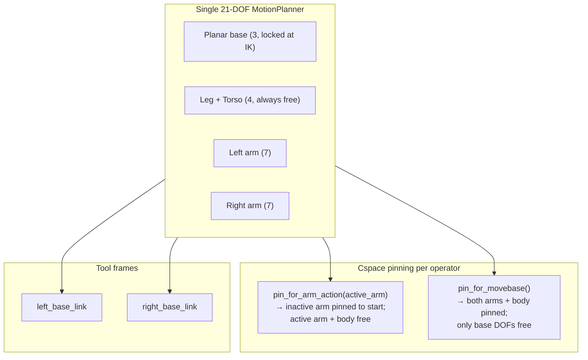

# cuTAMP with Booster T1

## Quick Links

The full README with installation instructions, examples, and detailed
documentation can be found in [README_DETAILED.md](README_DETAILED.md). Notes
on the cuRobo v0.8 port that defines this branch's architecture are in
[docs/curobo_v08_port.md](docs/curobo_v08_port.md).

## T1 Single-Planner Architecture (cuRobo v0.8)

This branch (`curobo_v2`) plans for the T1 humanoid through a **single 21-DOF
MotionPlanner** built from `t1_planar_base.yml`. The cspace is:

```
3 base (planar: base_j_x, base_j_y, base_j_yaw)   ← locked at IK time, free during navigate
2 leg  (ankle_pitch, knee_pitch)
2 torso (Torso_Pitch, Waist_Yaw)
7 left arm  (Left_Shoulder_Pitch ... Left_Hand_Roll)
7 right arm (Right_Shoulder_Pitch ... Right_Hand_Roll)
= 21 DOF
```

The mobile base is added as a virtual chain via `extra_links`
(`world → base_j_x → base_j_y → base_j_yaw → mobile_base_link`) and locked at
IK / motion-planner construction time, leaving an 18-DOF active cspace for arm
operators. Two tool frames (`left_base_link`, `right_base_link`) are exposed
on the same kinematics; per-arm IK uses `GoalToolPose` to target one frame at
a time.



There is no per-arm "shared joint" propagation — the body joints are
genuinely shared in one cspace, so trajopt updates them coherently. The
inactive arm's tool moves through world during single-arm planning because
the body translates; the visualizer tracks both arms' held objects through
every trajectory (see `T1State.compute_all_held_obj_poses`).

## Layout

### 📁 [`cutamp/robots/`](cutamp/robots/)

- **[`assets/t1_description/`](cutamp/robots/assets/t1_description/)**:
  - `t1_simplified.urdf` — URDF the planner loads (adds the `world` link the
    planar-base chain attaches to). `actual_robot.urdf` is the unmodified
    upstream URDF kept for reference.
  - `t1_planar_base.yml` — single cuRobo robot config: kinematics, cspace,
    `lock_joints` (head + grippers), `collision_link_names`, planar-base
    `extra_links`, and the two tool frames.
  - `t1_spheres.yml` — collision spheres in each link's local frame; finger
    spheres are consolidated into `left_base_link` / `right_base_link` since
    the gripper joints are locked open.
  - `left_gripper_spheres.pt`, `right_gripper_spheres.pt` — pre-fit gripper
    spheres used by grasp sampling.
  - `meshes/` — STL meshes referenced by the URDF.

- [`__init__.py`](cutamp/robots/__init__.py) — `RobotContainer` factory and
  `load_robot_container("t1")`. T1 exposes two tool frames; tool↔EE transforms
  account for T1's +X-toward-fingertips EE convention.

- [`t1.py`](cutamp/robots/t1.py) — T1 module:
  - cuRobo loaders: `get_t1_kinematics`, `get_t1_ik_solver(scene, arm=…)`
    (one IK per arm, scoped to its tool frame), `get_t1_motion_planner` (the
    single planner with the base lock applied).
  - Joint-name + index constants: `JOINT_NAMES_FULL`, `BASE_INDICES`,
    `BODY_INDICES`, `LEFT_ARM_JOINT_NAMES`, `RIGHT_ARM_JOINT_NAMES`,
    `t1_home`.
  - `T1RerunRobot` for visualization: maps the planner's cspace (18 active or
    21 full) into the URDF's joint count, splices in head + per-arm gripper
    state.

### 📁 [`cutamp/`](cutamp/) — core

- [`tamp_world.py`](cutamp/tamp_world.py) — `TAMPWorld` wraps a TAMPEnvironment
  with the collision Scene, the single `Kinematics`, two per-arm
  `InverseKinematics` solvers (keyed by tool-frame name), and a
  `MotionPlanner` factory. `q_init` is one 21-DOF tensor.

- [`t1_state.py`](cutamp/t1_state.py) — `T1State` carries the planner,
  kinematics, current joint state, and per-arm `arm_holding` /
  `arm_grasp_transform`. Cspace pinning lives here:
  - `pin_for_arm_action(arm)` — pin inactive arm; body + active arm free.
  - `pin_for_movebase()` — pin both arms + body; only base free.
  - `unpin()` — restore original weights.
  - `compute_held_obj_poses(arm, plan)` — per-timestep `world_from_obj` for a
    held object along a planner trajectory.
  - `compute_all_held_obj_poses(plan)` — `{arm: (obj_name, poses)}` for every
    arm currently holding (visualization needs both because the inactive
    arm's tool still translates with the body).

- [`_curobo_internals.py`](cutamp/_curobo_internals.py) — every cuRobo
  private-API workaround in one file (with `# TODO: file upstream issue`
  markers): `get_attachment_manager`, `cspace_plan_succeeded`,
  `write_cspace_target_dof_weight` / `snapshot…` / `restore…` for the
  per-rollout target-weight tensors.

- [`motion_solver.py`](cutamp/motion_solver.py) — drives the plan skeleton
  through the single planner. Per-operator: pin the cspace, plan, append a
  trajectory entry to `accum_plans` (with `held_objs` for both arms), then
  attach/detach via the AttachmentManager. Playback walks `accum_plans` and
  hands each entry to the visualizer.

- [`grasp_planning.py`](cutamp/grasp_planning.py) — `plan_single_arm_grasp` /
  `plan_single_arm_pose` adapt v0.8's `plan_grasp` / `plan_pose` to a single
  active tool frame while disabling the inactive frame's pose criterion.

- [`particle_initialization.py`](cutamp/particle_initialization.py) — IK-seeded
  particle init for `LeftPick` / `RightPick` / `LeftPlace` / etc. Cache
  hits route through `_apply_cached`.

- [`t1_domain.py`](cutamp/t1_domain.py) — TAMP domain (fluents + operators)
  for T1: `LeftAt` / `RightAt`, `LeftHolding` / `RightHolding`,
  `LeftMoveFree` / `RightMoveFree`, `LeftPick` / `RightPick`, `LeftPlace` /
  `RightPlace`, `LeftPush` / `RightPush`, `LeftPushStick` / `RightPushStick`,
  and the `RetractHolding` / `RetractFree` family.

- [`config.py`](cutamp/config.py) — `TAMPConfiguration` (only T1 supported);
  `soft_cost: Optional[List[str]]`, `optimize_soft_costs`,
  `debug_motion_failures`.

- [`algorithm.py`](cutamp/algorithm.py) — `setup_cutamp` + `run_cutamp`
  outer loop. The motion-plan retry sweep lives in `_motion_plan_with_retries`.

- [`optimize_plan.py`](cutamp/optimize_plan.py) — Adam-based optimization over
  particles; respects `left_q0` / `right_q0` as fixed initial-state.

- [`cost_function.py`](cutamp/cost_function.py) — single-arm soft costs
  (`retract_close_to_home`, `minimize_body_movement`) + the multi-object
  costs from `costs.py`. Hard collision constraints over each `q_*`.

- [`rollout.py`](cutamp/rollout.py) — FK rollout helpers used by the cost
  graph (forward kinematics on the full 21-DOF cspace).

- [`conf_locking.py`](cutamp/conf_locking.py) — utility for freezing a
  configuration during optimization (e.g., already-satisfied IKs).

- [`utils/motion_diagnostics.py`](cutamp/utils/motion_diagnostics.py) —
  cspace-failure diagnostic helpers (gated behind
  `config.debug_motion_failures`; not on the hot path by default).

- [`utils/visualizer.py`](cutamp/utils/visualizer.py) — Rerun visualizer.
  `log_joint_trajectory_with_mat4x4s(traj, mat4x4s, …)` accepts any number
  of held-object transforms per trajectory.

### 📁 [`cutamp/tests/`](cutamp/tests/) — 12 tests

- [`test_t1_config.py`](cutamp/tests/test_t1_config.py) — YAML schema /
  cspace / lock-joints / DOF-constant checks for `t1_planar_base.yml`.
- [`test_t1_robot_module.py`](cutamp/tests/test_t1_robot_module.py) —
  RobotContainer, both tool frames, joint-limit shape, kinematics
  smoke-test.

Run with: `PYTEST_DISABLE_PLUGIN_AUTOLOAD=1 pytest cutamp/tests/ -v`.

### 📁 [`cutamp/scripts/`](cutamp/scripts/)

- [`run_cutamp.py`](cutamp/scripts/run_cutamp.py) — main entry point.
  T1 / `blocks_t1` only (no `--robot` flag, no other envs in this branch).
- [`gripper_sphere_editor.py`](cutamp/scripts/gripper_sphere_editor.py) —
  interactive gripper-sphere editor.
- [`robot_sphere_editor.py`](cutamp/scripts/robot_sphere_editor.py) —
  interactive robot-sphere editor.

## Usage

```bash
# Smoke test (no motion plan)
python -m cutamp.scripts.run_cutamp --env blocks_t1 -n 16 --num_opt_steps 50

# Full run with motion planning, no visualizer
PYTORCH_ALLOC_CONF=expandable_segments:True python -m cutamp.scripts.run_cutamp \
    --env blocks_t1 --motion_plan -n 64 --disable_visualizer

# With Rerun visualizer
PYTORCH_ALLOC_CONF=expandable_segments:True python -m cutamp.scripts.run_cutamp \
    --env blocks_t1 --motion_plan -n 64

# Soft-cost optimization
python -m cutamp.scripts.run_cutamp --env blocks_t1 --motion_plan \
    --soft_cost retract_close_to_home minimize_body_movement --optimize_soft_costs
```

**Available soft costs** (T1-only ones marked):
- `retract_close_to_home` *(T1)* — penalize retract configs far from `t1_home`.
- `minimize_body_movement` *(T1)* — penalize body (leg/torso/waist) drift.
- `dist_from_origin`, `max_obj_dist` / `min_obj_dist`, `min_y` / `max_y`,
  `align_yaw` — multi-object placement costs.

VRAM at `-n 64`: ~4.2 GiB above baseline (peaks at the end of motion
planning). Comfortably fits a 24 GB GPU.

## Key Design Decisions

1. **Single 21-DOF MotionPlanner** — cuRobo v0.8's `GoalToolPose` lets us
   plan for one tool frame at a time on a kinematics that exposes both arms,
   so we no longer need two MotionGens or per-arm "shared joint" propagation.

2. **Planar base via `extra_links`** — `world → base_j_x → base_j_y →
   base_j_yaw → mobile_base_link` adds 3 virtual DOFs that get hard-locked at
   IK / motion-planner construction time for arm operators (so the base
   doesn't drift while reaching), and unlocked for `MoveBaseTo`.

3. **Cspace pinning replaces per-arm planners** — `pin_for_arm_action` /
   `pin_for_movebase` write into each rollout's
   `cspace_target_dof_weight` to keep the inactive joints at the start
   state. Restored by `unpin()`.

4. **Both arms tracked through every trajectory** — body joints are unlocked
   during single-arm planning, so an inactive arm holding a block will still
   translate that block through world. `compute_all_held_obj_poses` returns
   poses for every holding arm so the visualizer renders both correctly.

5. **Retract after pick/place** — `RetractHolding` (collision checks exclude
   held object) and `RetractFree` (empty gripper) move toward `t1_home` after
   each manipulation. Hard collision constraints + the
   `retract_close_to_home` soft cost shape the result.

6. **cuRobo internals isolated** — every reach into cuRobo's private API
   lives in [`cutamp/_curobo_internals.py`](cutamp/_curobo_internals.py) so a
   future cuRobo upgrade has one place to audit.
