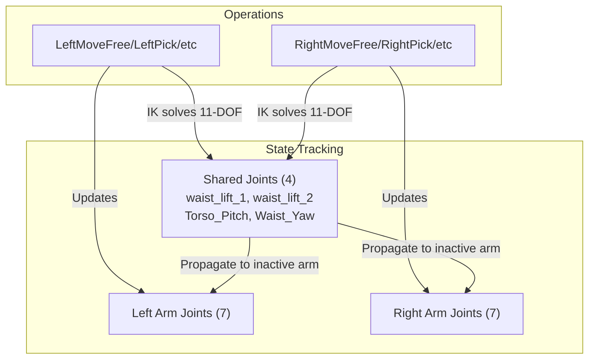

# cuTAMP with Booster T1

## Quick Links

The full README with installation instructions, examples, and detailed documentation can be found in [README_DETAILED.md](README_DETAILED.md).

## T1 Dual-Arm Architecture

The T1 robot has **4 shared joints** (lift + torso) that appear in both arms' 11-DOF kinematic chains. When either arm moves, these shared joints can change, affecting the other arm's end-effector position.

## Modifications

### 📁 **[Robots Folder](cutamp/robots/)**

- **t1_description/** - T1 robot assets and configuration files:
  - `t1_simplified.urdf` - Simplified URDF model for T1 dual-arm humanoid robot
  - `t1_left_11dof.yml` / `t1_right_11dof.yml` - cuRobo configuration files for left/right arm (11 DOF each: 2 lift + 2 torso + 7 arm)
  - `t1_spheres.yml` - Collision sphere definitions for motion planning
  - `left_gripper_spheres.pt` / `right_gripper_spheres.pt` - Pre-computed gripper collision spheres for grasp planning
  - `meshes/` - STL mesh files for robot visualization and collision checking

- [`__init__.py`](cutamp/robots/__init__.py) - Robot container factory and registry:
  - `DualArmRobotContainer` dataclass for dual-arm robots
  - `load_robot_container()` with T1 support
  - Tool frame transformations (`tool_from_ee`) for top-down grasping

- [`t1.py`](cutamp/robots/t1.py) - T1 dual-arm humanoid robot module:
  - cuRobo integration (kinematics, IK solvers, collision spheres)
  - `curobo_to_urdf_joints()` - Maps 11-DOF cuRobo config to 28-DOF URDF
  - `curobo_dual_arm_to_urdf_joints()` - Combines both arms' configs for visualization
  - `T1RerunRobot` class for Rerun visualization (handles 11/22/28 DOF inputs)

### 📁 **[Core Modifications](cutamp/)**

- [`tamp_world.py`](cutamp/tamp_world.py) - Dual-arm world support:
  - `is_dual_arm` property
  - Arm-specific accessors: `get_kin_model(arm)`, `get_tool_from_ee(arm)`, `get_ik_solver(arm)`, `get_gripper_spheres(arm)`, `get_joint_limits(arm)`
  - Dual `q_init` support (`left_q_init`, `right_q_init` properties)
  - Uses T1's `get_initial_state` for dual-arm initial state

- [`t1_domain.py`](cutamp/t1_domain.py) - TAMP domain for T1 dual-arm robot:
  - Arm-specific fluents: `LeftAt`, `RightAt`, `LeftHandEmpty`, `RightHandEmpty`, `LeftHolding`, `RightHolding`, `LeftCanMove`, `RightCanMove`, etc.
  - Arm-specific operators: `LeftMoveFree`, `RightMoveFree`, `LeftPick`, `RightPick`, `LeftPlace`, `RightPlace`, `LeftPush`, `RightPush`, `LeftPushStick`, `RightPushStick`
  - Separate task planning for each arm

- [`algorithm.py`](cutamp/algorithm.py) - Setup for dual-arm:
  - `setup_cutamp()` loads both `q_home_left` and `q_home_right` for T1
  - Warmups IK solvers for both arms
  - Passes dual configs to visualizer (22-DOF concatenated)

- [`particle_initialization.py`](cutamp/particle_initialization.py) - Dual-arm particle sampling:
  - `get_arm_from_operator()` - Extracts arm from operator name (e.g., "LeftPick" → "left")
  - `propagate_shared_joints()` - Syncs 4 shared joints between arms after IK solve
  - All operators (Pick, Place, Push, PushStick) support T1 variants
  - Arm-specific resource access (gripper spheres, joint limits, tool_from_ee, IK solver)

- [`rollout.py`](cutamp/rollout.py) - Dual-arm forward kinematics:
  - `get_conf_to_arm()` - Maps configuration names to their arm
  - Arm-specific FK computation for each configuration
  - Arm-specific `tool_from_ee` for `world_from_ee_desired` computation

- [`cost_function.py`](cutamp/cost_function.py) - Dual-arm costs:
  - Separate self-collision cost functions per arm
  - Arm-specific joint limit checking
  - `conf_to_arm` mapping for per-configuration cost computation

- [`optimize_plan.py`](cutamp/optimize_plan.py) - Dual-arm optimization:
  - Skips optimization for both `left_q0` and `right_q0`
  - T1 gripper joint handling for visualization
  - Dual-arm initial state visualization (22-DOF)

- [`motion_solver.py`](cutamp/motion_solver.py) - Dual-arm motion planning:
  - Supports all T1 operators
  - Arm-specific motion generator, kinematics, and tool_from_ee
  - T1 gripper joint values for visualization
  - Currently requires single-arm plans (both arms in same plan not yet supported)

- [`task_planning/search.py`](cutamp/task_planning/search.py) - Prefixed parameter support:
  - `_sample_param_type()` handles prefixed names (e.g., `left_q0`, `right_pose1`)
  - Extracts prefix and number from parameter names using regex

- [`utils/visualizer.py`](cutamp/utils/visualizer.py) - Visualization:
  - Optional `q_init` for dual-arm flexibility

### 📁 **[Tests](cutamp/tests/)**

- [`test_t1_robot_module.py`](cutamp/tests/test_t1_robot_module.py) - T1 robot module tests
- [`test_tamp_world_dual_arm.py`](cutamp/tests/test_tamp_world_dual_arm.py) - Dual-arm helper method tests
- [`test_shared_joint_consistency.py`](cutamp/tests/test_shared_joint_consistency.py) - Shared joint propagation tests:
  - Tests for `get_arm_from_operator()`
  - Tests for `propagate_shared_joints()` across sequential operations
  - Verifies arm-specific joints remain unchanged during propagation
- [`debug_t1_tool_frame.py`](cutamp/tests/debug_t1_tool_frame.py) - Tool frame transformation debug script

### 📁 **[Scripts Folder](cutamp/scripts/)**

Available scripts:
- [`gripper_sphere_editor.py`](cutamp/scripts/gripper_sphere_editor.py) - Interactive gripper sphere editor for grasp sampling
- [`robot_sphere_editor.py`](cutamp/scripts/robot_sphere_editor.py) - Interactive robot sphere editor for cuRobo

## Key Design Decisions

1. **11-DOF per arm model** - Each arm's cuRobo model includes the 4 shared joints (lift + torso) plus 7 arm joints

2. **State tracking approach** - Track full robot state and propagate shared joints across operations:
   - When left arm IK solves → update ALL right arm configs' shared joints
   - When right arm IK solves → update ALL left arm configs' shared joints

3. **Inactive arm inherits shared joints** - The inactive arm's local joints (7 DOF) remain fixed, but its EE position changes due to torso movement

4. **Collision checking** - Uses arm-specific self-collision models; inter-arm collision not yet implemented
